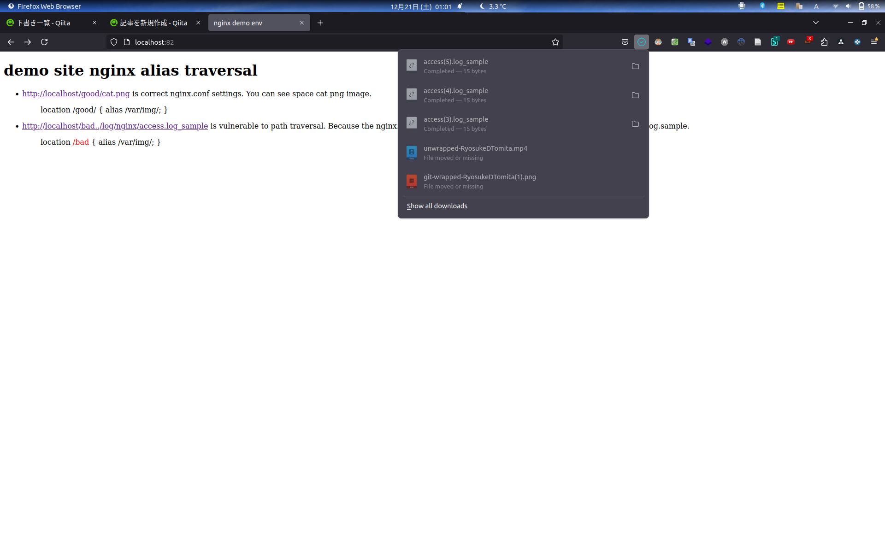

# Nginx alias traversal demo


## INDEX

- [ABOUT](#about)
- [ENVIRONMENT](#environment)
- [PREPARING](#preparing)
- [HOW TO USE](#how-to-use)
- [REFERENCE](#reference)

---

## ABOUT

Nginx alias traversal.

> [!NOTE]
> In the pattern where this location is used in combination with alias, a critical vulnerability arises when two conditions are met:
> 1. no trailing slash at the end of the URL specified in the location
> 2. a trailing slash at the end of the path specified in the alias

```
# correct nginx.conf settings
location /good/ {
  alias /var/img/;
}
```

```
# vulnerble nginx.conf settings

location /bad {
  alias /var/img/;
}
```

---

## ENVIRONMENT

nginx 1.25.5

[see Dockerfile](./Dockerfile)

---

## PREPARING

```shell
cd directory_traversal/
docker compose up
```

---

## HOW TO USE

After the Docker container run, go to [localhost:82](http://localhost:82).


1. http://localhost/good/cat.png is correct nginx.conf settings. You can see the image file.

2. http://localhost:82/bad../log/nginx/access.log_sample is vulnerable. You can get access.log_sample



---

## REFERENCE

- [Hunting for Nginx Alias Traversals in the woid](https://labs.hakaioffsec.com/nginx-alias-traversal/)
- [Gigazine](https://gigazine.net/news/20230708-nginx-alias-traversal/)
