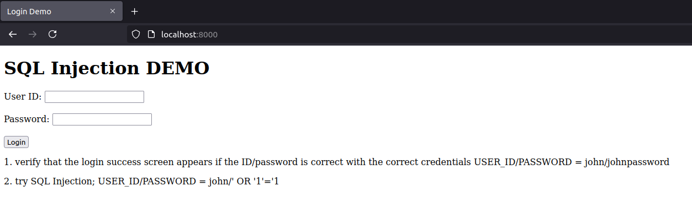
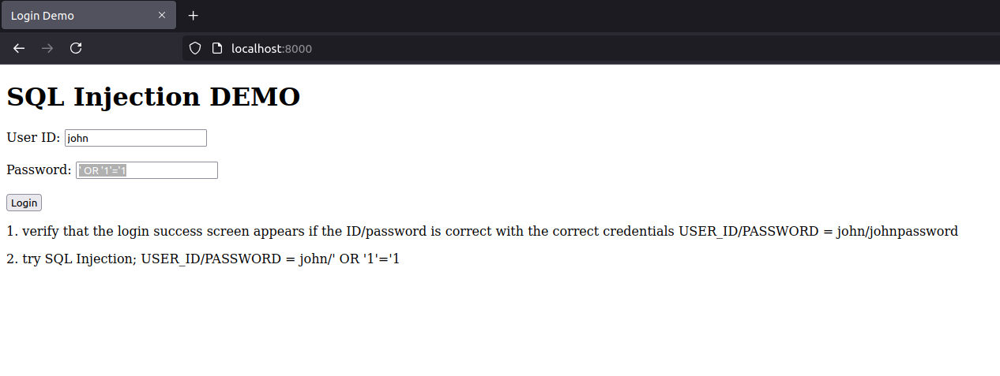
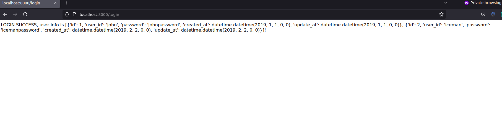

# SQL Injection

## HOW TO USE

```shell
docker compose up -d
```

- DB connection Test (See compose.yaml for the password).

```shell
mysql -h 127.0.0.1 -P 3307 -u root -p
```

---

## TRY SQL Injection

1. verify that the login success screen appears if the ID/password is correct with the correct credentials USER_ID/PASSWORD = john/johnpassword
2. try SQL Injection; USER_ID/PASSWORD = john/' OR '1'='1




