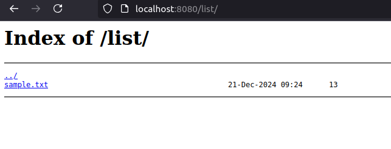
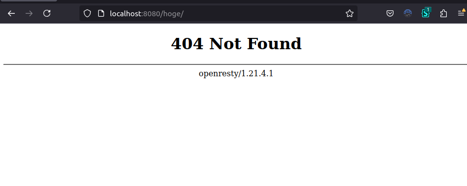
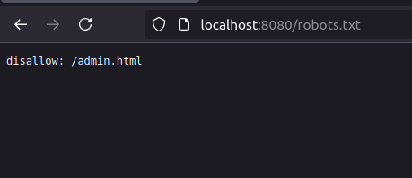

# Vulnerable Server Settings

## ENVIRONMENT

OpenResty

---

## PREPARING

```shell
docker compose up
```

---

## HOW TO USE

### Try Directory Listing

Go to [http://localhost:8080/list/](http://localhost:8080/list/)



### Version information is exposed from Error Screen

Go to [http://localhost:8080/hoge](http://localhost:8080/hoge)



### Version information is exposed from Server Header

You can see `Server: openresty/1.21.4.1`

```shell
curl -v http://localhost:8080 2>&1 | grep '< '

< HTTP/1.1 200 OK
< Server: openresty/1.21.4.1
< Date: Sat, 21 Dec 2024 10:22:30 GMT
< Content-Type: text/html
< Content-Length: 601
< Last-Modified: Sat, 21 Dec 2024 10:14:57 GMT
< Connection: keep-alive
< ETag: "67669521-259"
< Accept-Ranges: bytes
```

### Path information exposed by robots.txt (Just for your information)

Go to [http://localhost:8080/robots.txt](http://localhost:8080/robots.txt) and you can find `admin.html`

